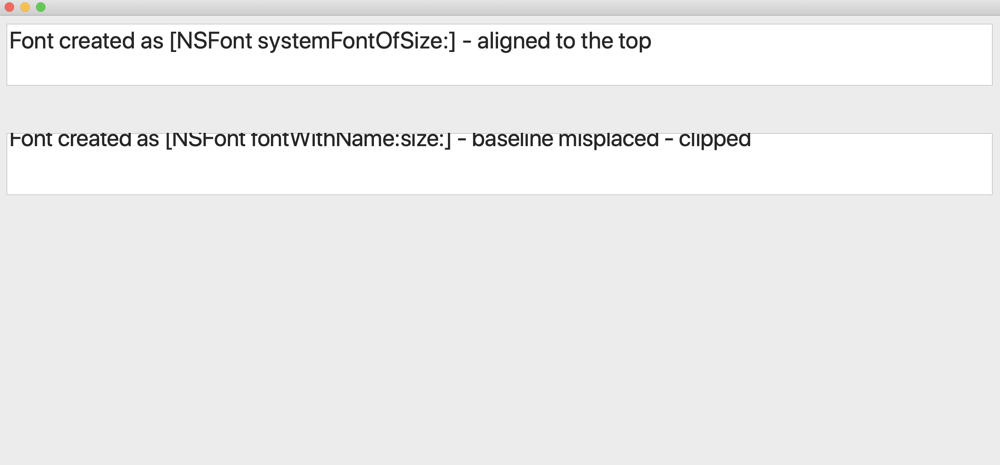

# CustomFonts
Demo app showing potential MacOS bug with text baseline. 

The screenshot below demonstrates two NSTextField controls created with system font obtained via two different NSFont APIs:
- [systemFontOfSize:](./main.mm#L55)
- [fontWithName:size:](./main.mm#L59)

Dumping all documented properties of these two fonts and their descriptors shows no difference. However, there's a noticeable difference in the rendering.

